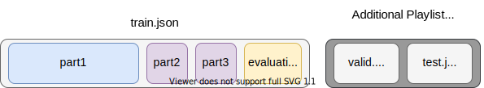

# Melon Playlist Continuation
This is extra solution in [Melon Playlist Continuation](https://arena.kakao.com/c/7) by [***](https://github.com/ssstttaaarrr) Team.  
It is inspired by [A hybrid two-stage recommender system for automatic playlist continuation](https://dl.acm.org/doi/pdf/10.1145/3267471.3267488) which is 3rd place in [RecSys Challenge ’18](http://www.recsyschallenge.com/2018/) and [Relational Learning via Collective Matrix Factorization](http://www.cs.cmu.edu/~ggordon/singh-gordon-kdd-factorization.pdf).  

## Dataset
As stated in the [Challenge Readme](https://arena.kakao.com/c/7/data), the dataset in `data.tar.gz` contains 150K playlists that have been created by [Melon](https://www.melon.com/) users.  
Untar dataset as follow.
```bash
tar -xvzf data.tar.gz
```
The `data/train.json` contains all the data, whereas `data/val.json` and `data/test.json` are just for submission, so only some of the songs and tags are included.  
So in this repository, we just consider `data/val.json` and `data/test.json` as additional information.

## Solution
- Phase 1. Extract Candidates using CMF Recommandation(song+tag matrix)
- Phase 2. Re-rank candidates using Learning-To-Rank Boosting

## Preprocessing - Data Partitioning
For local evaluation, we create the new `evaluation` dataset. The `part2`, `part3` are train, valid dataset respectively.  
`part2`, `part3` and `evaluation` are divided question (_q) and answer (_a) part for Boosting's input format.  
In Phase 1., we train `part1`+`part2_q`+`part3_q`+`evaluation_q` and optionally include `valid.json`+`test.json` as additional information.  
In Phase 2., we use `part2_q`, `part3_q` as inputs and use `part2_a`, `part3_a` as labels.  
Please refer to the [A hybrid two-stage recommender system for automatic playlist continuation](https://dl.acm.org/doi/pdf/10.1145/3267471.3267488) for detailed partitioning.



## Usage
### Preprocessing
```bash
python3 preprocess.py run ./data/train.json
```
After run as above, the preprocessed directory is as follow.  
```
├── preprocessed
    ├── inputs
       ├── part1.json
       ├── part2_q.json
       ├── part3_q.json
       └── evaluation_q.json
    └── lables
       ├── part2_a.json
       ├── part3_a.json
       └── evaluation_a.json
```

### Train and Predict
```bash
python3 run.py --dir ./preprocessed --additional ./data/val.json ./data/test.json
```
The `--additional` flag is optional.
```bash
python3 run.py --dir ./preprocessed
```

### Evaluation
```bash
python3 evaluate.py --result ./result.json
```

## Score
```
Music nDCG: 0.244151
Tag nDCG: 0.420992
Final Score: 0.270677
```
Final Score = Music nDCG * 0.85 + Tag nDCG * 0.15

## Running Environment
We test this implementation under Python 3.6.9, on a Intel Core i7-9700 CPU and 32GB RAM.